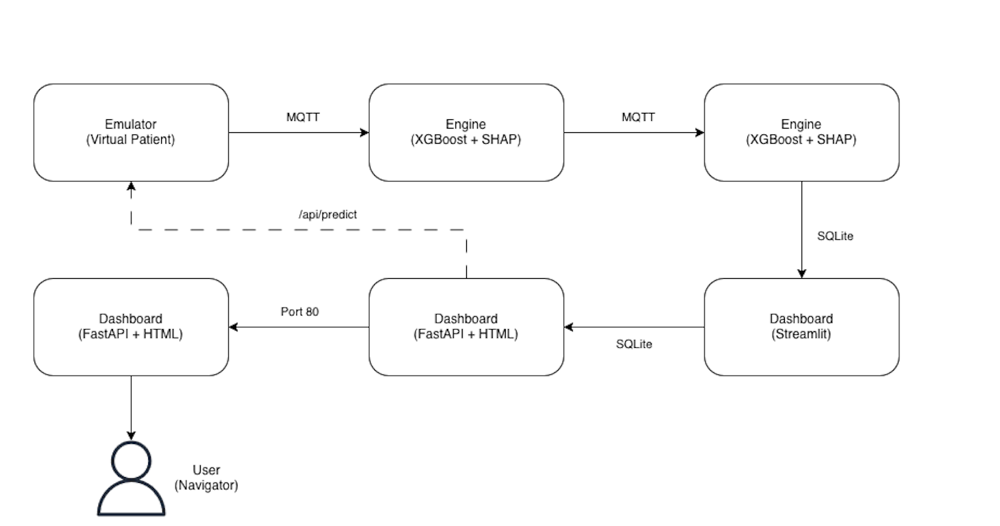
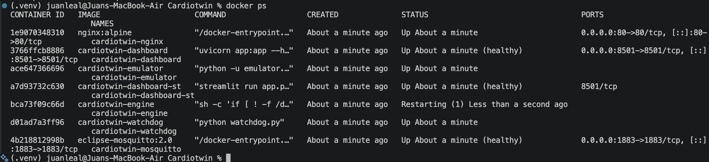
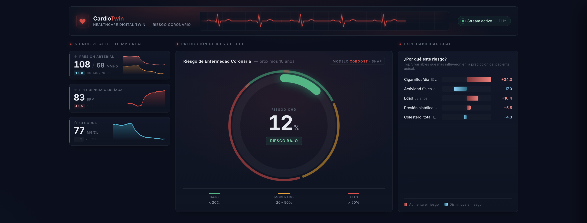
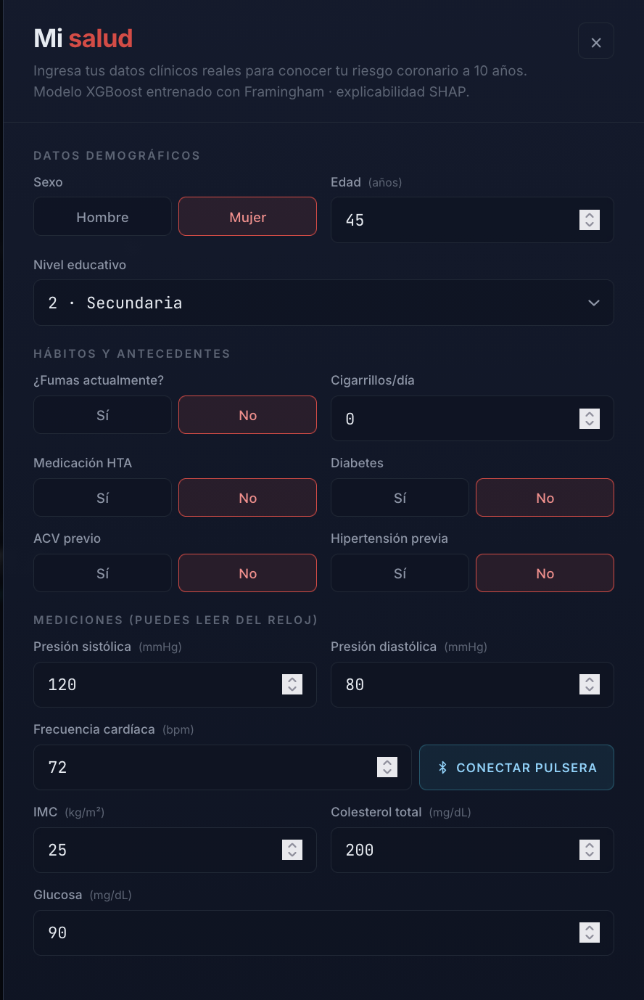
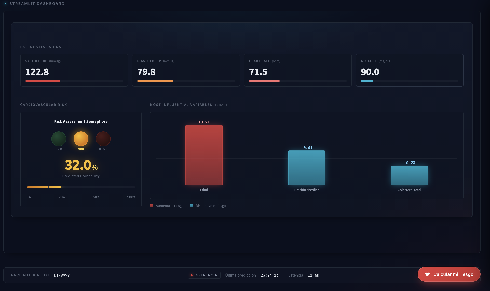
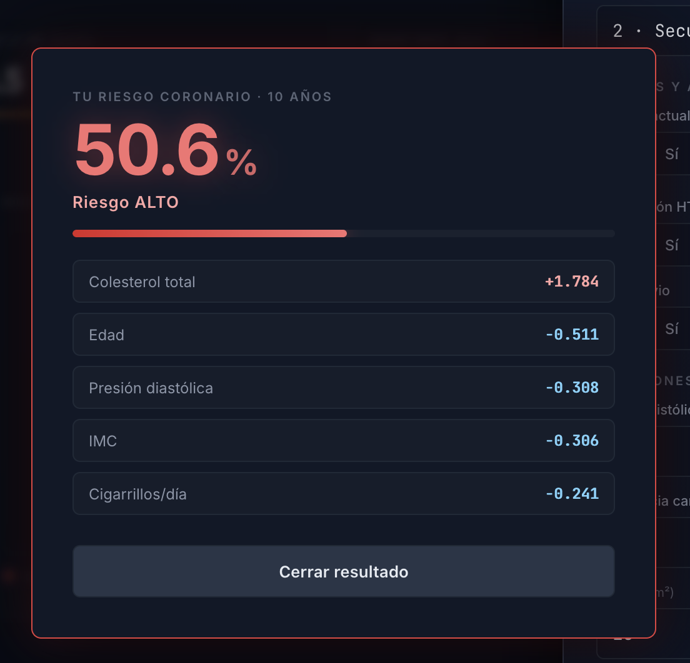
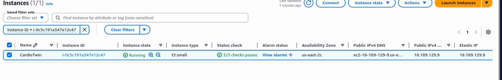

# CardioTwin: Healthcare Digital Twin para Predicción de Riesgo Coronario

**Integrantes:** Juan Pablo Contreras - Juan Carlos Leal - Tomas Ramirez

> Plataforma de gemelo digital cardiovascular que simula pacientes en tiempo real, predice el riesgo de enfermedad coronaria (CHD) a 10 años mediante **XGBoost + SHAP**, y permite inyectar datos clínicos reales para obtener predicciones personalizadas. Desplegado como **6 microservicios Docker** orquestados con Docker Compose en una instancia **EC2 de AWS** con dominio público vía **DuckDNS**.

## Tabla de Contenido

1. [Descripción del Proyecto](#descripción-del-proyecto)
2. [Arquitectura](#arquitectura)
3. [Modelo de Inteligencia Artificial](#modelo-de-inteligencia-artificial)
4. [Microservicios](#microservicios)
5. [Interoperabilidad — FHIR HL7 R4](#interoperabilidad--fhir-hl7-r4)
6. [Frontend y Dashboards](#frontend-y-dashboards)
7. [Gemelo Digital — Flujo Completo](#gemelo-digital--flujo-completo)
8. [Despliegue en AWS](#despliegue-en-aws)
9. [Instalación y Ejecución Local](#instalación-y-ejecución-local)
10. [Stack Tecnológico](#stack-tecnológico)
11. [Pruebas y Evidencias](#pruebas-y-evidencias)
12. [Conclusiones](#conclusiones)
13. [Links](#links)

---

## Descripción del Proyecto
CardioTwin es un gemelo digital cardiovascular** que:

- **Simula un paciente virtual** en tiempo real, generando signos vitales (presión arterial, frecuencia cardíaca, glucosa) con variabilidad fisiológica realista mediante un random walk con mean-reversion.
- **Predice el riesgo de Enfermedad Coronaria (CHD) a 10 años** utilizando un modelo XGBoost entrenado con el dataset de Framingham Heart Study (4,240 registros, 15 features clínicas).
- **Explica cada predicción** mediante SHAP (SHapley Additive exPlanations), mostrando las variables que más influyen en el riesgo del paciente.
- **Permite inyectar datos reales** de una persona a través de un formulario clínico con 15 campos y conexión vía **Web Bluetooth** a monitores de frecuencia cardíaca. Estos datos alimentan al gemelo digital, que comienza a simular el perfil de esa persona.
- **Empaqueta los datos en estándar FHIR HL7 R4**, garantizando interoperabilidad con sistemas de salud.

**Entidades principales:**
| Entidad | Descripción |
|---------|-------------|
| `Paciente virtual` | Perfil clínico extraído del dataset Framingham (o inyectado manualmente) con 15 features |
| `Telemetría` | Signos vitales en tiempo real: sysBP, diaBP, heartRate, glucose — con ruido fisiológico |
| `Predicción` | Probabilidad CHD (0–100%) calculada por XGBoost + top SHAP features por cada ciclo |
| `Observación FHIR` | Cada vital empaquetada como `Observation` R4 con códigos LOINC en un `Bundle` |

---

## Arquitectura
### Diagrama General



### Flujo de Datos
1. El **Emulator** lee el dataset Framingham, selecciona un paciente y genera telemetría cada 5 segundos con ruido gaussiano (N(µ=0, σ=2)) y mean-reversion, publicando vía MQTT al topic `cardiotwin/telemetry/raw`.
2. El **Engine** escucha ese topic, ejecuta la predicción XGBoost + SHAP, y publica el resultado a `cardiotwin/telemetry/predictions`.
3. El **Watchdog** escucha ambos topics y persiste todo en SQLite (`telemetry` + `predictions`).
4. El **Dashboard** (FastAPI) sirve el frontend y expone `/api/state` (lectura) y `/api/predict` (predicción personalizada).
5. El **Frontend** (index.html) consume `/api/state` cada 2.5s y renderiza vitales, riesgo y SHAP en tiempo real.
6. Cuando el usuario envía datos desde el formulario → `/api/predict` → escribe `custom_patient.json` → el Emulator adopta el perfil y el stream completo se actualiza.

---

## Modelo de Inteligencia Artificial
### Dataset — Framingham Heart Study
El [Framingham Heart Study](https://www.framinghamheartstudy.org/) es uno de los estudios cardiovasculares más importantes de la historia. El dataset contiene 4,240 registros de pacientes con 15 features clínicas y una variable objetivo binaria: `TenYearCHD` (riesgo de enfermedad coronaria a 10 años).

| Feature | Descripción | Rango |
|---------|-------------|-------|
| `male` | Sexo biológico (1=hombre, 0=mujer) | 0–1 |
| `age` | Edad en años | 18–110 |
| `education` | Nivel educativo | 1–4 |
| `currentSmoker` | Fumador activo | 0–1 |
| `cigsPerDay` | Cigarrillos por día | 0–80 |
| `BPMeds` | Medicación antihipertensiva | 0–1 |
| `prevalentStroke` | Antecedente de ACV | 0–1 |
| `prevalentHyp` | Hipertensión previa | 0–1 |
| `diabetes` | Diabetes | 0–1 |
| `totChol` | Colesterol total (mg/dL) | 80–600 |
| `sysBP` | Presión arterial sistólica (mmHg) | 60–260 |
| `diaBP` | Presión arterial diastólica (mmHg) | 30–160 |
| `BMI` | Índice de masa corporal (kg/m²) | 10–70 |
| `heartRate` | Frecuencia cardíaca (bpm) | 30–220 |
| `glucose` | Glucosa en ayunas (mg/dL) | 30–500 |

**Target:** `TenYearCHD` — 0 (sin riesgo) o 1 (riesgo de CHD a 10 años). Prevalencia: ~15.2%.

### Modelo — XGBoost Classifier
Se eligió XGBoost (eXtreme Gradient Boosting) por:
- Alto rendimiento en datos tabulares con features mixtas (numéricas + binarias).
- Compatibilidad nativa con `shap.TreeExplainer` para explicabilidad eficiente.
- Manejo robusto de desbalance de clases mediante `scale_pos_weight`.

**Configuración del modelo en producción (`train.py`):**
```python
XGBClassifier(
    n_estimators=200,
    max_depth=4,
    learning_rate=0.1,
    objective="binary:logistic",
    eval_metric="logloss",
    scale_pos_weight=neg/pos,  # ~5.57 para compensar desbalance
    random_state=42,
    n_jobs=2,
)
```

**Entrenamiento alternativo en notebook (`model_training.ipynb`):**
Se explora también el uso de **SMOTE** (Synthetic Minority Over-Sampling Technique) para balancear las clases antes del entrenamiento. Este notebook documenta el proceso exploratorio completo:
1. Carga y limpieza del dataset (3,658 registros tras eliminar nulos)
2. Split estratificado 80/20
3. Aplicación de SMOTE (4,960 registros balanceados 50/50)
4. Entrenamiento XGBoost
5. Evaluación AUC-ROC
6. Serialización con joblib
7. Validación SHAP

### Explicabilidad — SHAP
Cada predicción incluye los **valores SHAP** (top 3 features más influyentes), que indican cuánto y en qué dirección cada variable empujó la probabilidad de riesgo:

- **Valor positivo** → la variable aumenta el riesgo (ej: `sysBP = +0.45` → la presión alta está subiendo el riesgo)
- **Valor negativo** → la variable disminuye el riesgo (ej: `age = -0.12` → la edad joven está protegiendo al paciente)

Esto se visualiza en el dashboard como barras de colores (rojo = aumenta, cyan = disminuye) con el nombre de la variable y su valor SHAP.

---

## Microservicios
El sistema está compuesto por **6 contenedores Docker** interconectados:

### 1. Emulator - Datos e Interoperabilidad
| | |
|---|---|
| **Archivo** | `services/emulator/emulator.py` |
| **Función** | Simula un paciente virtual en tiempo real |
| **Tecnología** | Python + paho-mqtt + fhir.resources |
| **Publica en** | `cardiotwin/telemetry/raw` (MQTT) |

- Lee el dataset Framingham y selecciona un paciente base (índice 0).
- Aplica un **random walk con mean-reversion** (Ornstein-Uhlenbeck simplificado) sobre sysBP, diaBP y heartRate:
  ```python
  current_vitals[field] += rng.normal(0, NOISE_SIGMA * 0.2)
  current_vitals[field] = current_vitals[field] * 0.95 + base_val * 0.05  # mean-reversion
  noisy = current_vitals[field] + rng.normal(NOISE_MU, NOISE_SIGMA * 0.5)
  ```
- Publica un mensaje JSON cada **5 segundos** (`PUBLISH_INTERVAL=5.0`).
- **Modo Paciente Personalizado:** Revisa cada ciclo si existe `/shared/custom_patient.json`. Si existe y cambió, adopta ese perfil como nueva base (patient_id = 9999).
- Enriquece el payload con **FHIR R4** (ver sección de interoperabilidad).

### 2. Engine - Modelo de IA
| | |
|---|---|
| **Archivo** | `services/engine/engine.py` + `train.py` |
| **Función** | Predice riesgo CHD y calcula SHAP |
| **Tecnología** | Python + XGBoost + SHAP + paho-mqtt |
| **Escucha** | `cardiotwin/telemetry/raw` |
| **Publica en** | `cardiotwin/telemetry/predictions` |

- Al arrancar, entrena el modelo XGBoost si no existe `/data/model.pkl` (se entrena una sola vez y se reutiliza).
- Por cada mensaje de telemetría: ejecuta `model.predict_proba()` y `shap.TreeExplainer.shap_values()`.
- Extrae las **top 3 features SHAP** y publica junto con la probabilidad de riesgo.
- Persiste las predicciones directamente en SQLite como respaldo.

### 3. Watchdog - Persistencia
| | |
|---|---|
| **Archivo** | `services/watchdog/watchdog.py` |
| **Función** | Persiste telemetría y predicciones en SQLite |
| **Tecnología** | Python + paho-mqtt + sqlite3 |
| **Escucha** | `cardiotwin/telemetry/raw` y `cardiotwin/telemetry/predictions` |

- Inicializa las tablas `telemetry` y `predictions` en `/data/cardiotwin.db`.
- Cada mensaje MQTT se inserta en la tabla correspondiente.
- Compatible con esquemas pre-existentes (agrega columna `glucose` si no existe).

### 4. Dashboard — FastAPI - Frontend principal
| | |
|---|---|
| **Archivo** | `services/dashboard/app.py` |
| **Función** | Sirve el frontend y expone la API REST |
| **Tecnología** | FastAPI + uvicorn + XGBoost + SHAP |
| **Puerto** | 8501 |

**Endpoints:**
| Método | Endpoint | Descripción |
|--------|----------|-------------|
| `GET` | `/` | Sirve `index.html` (dashboard principal) |
| `GET` | `/api/state` | Retorna vitales, riesgo e historial (últimos 60 registros) |
| `GET` | `/api/health` | Healthcheck: estado de DB y modelo |
| `POST` | `/api/predict` | Predicción personalizada con datos del usuario (15 campos) |

El endpoint `/api/predict`:
- Recibe un JSON con los 15 campos clínicos (validados por Pydantic con rangos médicos).
- Carga el modelo XGBoost entrenado (lazy-load con cache por mtime).
- Ejecuta predicción + SHAP.
- **Escribe `custom_patient.json`** en el volumen compartido para que el Emulator adopte el perfil.
- Retorna: `{ prediction, risk_pct, shap: [{name, impact}], input_echo }`.

### 5. Dashboard — Streamlit - Dashboard alternativo
| | |
|---|---|
| **Archivo** | `services/dashboard-st/app.py` |
| **Función** | Dashboard alternativo en Python |
| **Tecnología** | Streamlit |
| **Ruta** | `/streamlit/` (embebido como iframe) |

- Lee directamente de SQLite (no pasa por la API).
- Muestra vitales, semáforo de riesgo y SHAP en un diseño de tarjetas.
- Estilos CSS inyectados para coincidir con el tema oscuro del dashboard principal.
- Auto-refresco cada segundo (`st.rerun()`).

### 6. Nginx (Reverse Proxy)
| | |
|---|---|
| **Archivo** | `nginx/nginx.conf` |
| **Función** | Enruta tráfico HTTP a los dashboards |
| **Puerto** | 80 |

| Ruta | Destino |
|------|---------|
| `/` | Dashboard FastAPI (:8501) |
| `/streamlit/` | Dashboard Streamlit (:8501) |

Soporta WebSocket upgrade para las conexiones Streamlit.

### Broker MQTT — Eclipse Mosquitto
Mosquitto 2.0 actúa como bus de mensajes entre Emulator, Engine y Watchdog. Healthcheck integrado.

---

## Interoperabilidad — FHIR HL7 R4
El Emulator enriquece cada mensaje de telemetría con el estándar **FHIR R4** (Fast Healthcare Interoperability Resources), garantizando compatibilidad con sistemas de salud electrónicos.

Cada vital se empaqueta como un recurso `Observation` con:
| Vital | Código LOINC | Display | Unidad UCUM |
|-------|-------------|---------|-------------|
| Presión sistólica | `8480-6` | Systolic blood pressure | `mm[Hg]` |
| Presión diastólica | `8462-4` | Diastolic blood pressure | `mm[Hg]` |
| Frecuencia cardíaca | `8867-4` | Heart rate | `/min` |

Las Observations se agrupan en un Bundle FHIR de tipo `collection`:
```json
{
  "patient_id": 0,
  "sysBP": 128.45,
  "diaBP": 82.31,
  "heartRate": 74.2,
  "resourceType": "Bundle",
  "subject": { "reference": "Patient/0" },
  "fhir": {
    "resourceType": "Bundle",
    "type": "collection",
    "entry": [
      {
        "resource": {
          "resourceType": "Observation",
          "status": "final",
          "code": {
            "coding": [{ "system": "http://loinc.org", "code": "8480-6", "display": "Systolic blood pressure" }]
          },
          "subject": { "reference": "Patient/0" },
          "effectiveDateTime": "2026-05-10T22:15:30+00:00",
          "valueQuantity": { "value": 128.45, "unit": "mmHg", "system": "http://unitsofmeasure.org", "code": "mm[Hg]" }
        }
      }
    ]
  }
}
```

Implementado con la librería `fhir.resources` (v7.1.0) que valida la estructura contra el esquema FHIR R4 oficial.

---

## Frontend y Dashboards
### Dashboard Principal (`index.html`)
Aplicación single-page construida con HTML/CSS/JS vanilla (sin frameworks), servida por FastAPI:

- **ECG animado:** Tira de electrocardiograma SVG con animación fluida por `requestAnimationFrame`.
- **Vitales en tiempo real:** Sparklines con historial de 20 puntos para sysBP, diaBP, HR y glucosa.
- **Gauge de riesgo CHD:** Arco semicircular con zonas de color (verde/ámbar/rojo) y animación counter-up.
- **Panel SHAP:** Top 5 variables más influyentes con barras de impacto (rojo = aumenta riesgo, cyan = disminuye).
- **Formulario "Calcular mi riesgo":** Cajón lateral con 15 campos clínicos + toggles + conexión **Web Bluetooth** para leer frecuencia cardíaca desde un smartwatch/pulsera.
- **Polling inteligente:** `/api/state` cada 2.5s con deduplicación por timestamp para evitar re-animaciones innecesarias.


### Dashboard Streamlit (`/streamlit/`)
Vista alternativa en Python embebida como iframe, mostrando los mismos datos en formato de tarjetas con semáforo de riesgo y barras SHAP.


### Web Bluetooth — Lectura de Frecuencia Cardíaca
El formulario del dashboard incluye un botón "Conectar pulsera" que utiliza la **Web Bluetooth API** para leer datos desde un monitor de frecuencia cardíaca estándar:

- Servicio GATT: `heart_rate` (UUID estándar)
- Característica: `heart_rate_measurement`
- Protocolo: BLE (Bluetooth Low Energy)
- Requisitos: Chrome/Edge, localhost o HTTPS

```
Usuario -> Bluetooth -> Smartwatch/Pulsera -> heart_rate_measurement -> campo heartRate del formulario
```

---

## Gemelo Digital — Flujo Completo
El concepto de gemelo digital se materializa en la capacidad del sistema de crear una réplica virtual de un paciente real que evoluciona en tiempo real:

1. Usuario abre "Calcular mi Riesgo" e ingresa los datos (Puede usar el smart watch también)
2. Presiona el botón "Calcular mi riesgo"
3. Se realiza un POST al endpoint api/predict
4. Se escribe el custom_patient.json con la predicción instantanea (Riesgo + SHAP)
5. El emulator detecta el archivo y toma ese perfil como paciente base
6. El stream completo ahora "simula" al usuario
7. Se muestran vitales con variabildiad, predicciones de CHD y SHAP actualizado con cada ciclo


Esto es lo que distingue a CardioTwin de un simple calculador de riesgo: no solo predice, sino que crea un modelo virtual del paciente que evoluciona continuamente.

---

## Despliegue en AWS
### Infraestructura

CardioTwin está desplegado en **Amazon Web Services** sobre los siguientes recursos:

| Recurso | Detalle |
|---------|---------|
| Cómputo | EC2 `t3.micro` — Ubuntu 22.04 LTS |
| Red | IP pública elástica + Security Group con puertos 22 (SSH), 80 (HTTP), 443 (HTTPS), 1883 (MQTT) |
| DNS | **DuckDNS** — dominio gratuito `cardiotwin.duckdns.org` apuntando a la IP de la instancia |
| Proxy | **Nginx** corriendo dentro de Docker, enruta `/` al dashboard FastAPI y `/streamlit/` al dashboard Streamlit |
| Mensajería | **Eclipse Mosquitto** (MQTT) en el mismo host, accesible en el puerto 1883 |

### Proceso de Despliegue

1. **Crear la instancia EC2** (`t3.micro`, Ubuntu 22.04) y obtener su IP pública.
2. **Configurar DuckDNS** — registrar `cardiotwin.duckdns.org` y apuntarlo a la IP de EC2.
3. **Conectarse vía SSH** y preparar el servidor:
   ```bash
   sudo apt update && sudo apt install -y docker.io docker-compose git
   sudo usermod -aG docker ubuntu
   ```
4. **Clonar el repositorio** y levantar los servicios:
   ```bash
   git clone -b develop https://github.com/App-TDSE/Cardiotwin.git
   cd Cardiotwin
   docker compose up --build -d
   ```
5. El dashboard queda accesible en **[https://cardiotwin.duckdns.org](https://cardiotwin.duckdns.org)**.

---

## Instalación y Ejecución Local
### Requisitos Previos

- Docker y Docker Compose
- Git
- (Opcional) Terraform + cuenta Azure para despliegue cloud

### 1. Clonar el Repositorio
```bash
git clone https://github.com/App-TDSE/Cardiotwin.git
cd Cardiotwin
```

### 2. Levantar los Servicios
```bash
docker compose up --build -d
```
Esto levanta los 7 contenedores: mosquitto, engine, emulator, watchdog, dashboard, dashboard-st, nginx.

### 3. Acceder al Dashboard
- **Dashboard principal:** [http://localhost](http://localhost)
- **Dashboard Streamlit:** [http://localhost/streamlit/](http://localhost/streamlit/)
- **API Health:** [http://localhost/api/health](http://localhost/api/health)
- **API State:** [http://localhost/api/state](http://localhost/api/state)

### 4. Verificar que todo funcione
```bash
# Ver el estado de los contenedores
docker compose ps

# Ver logs del engine (predicciones)
docker compose logs -f engine

# Ver logs del emulator (telemetría)
docker compose logs -f emulator
```

### 5. (Opcional) Desplegar en AWS

Crear una instancia EC2 `t3.micro` con Ubuntu 22.04, abrir los puertos 22, 80, 443 y 1883 en el Security Group, configurar DuckDNS con la IP pública, y ejecutar los pasos de la sección [Despliegue en AWS](#despliegue-en-aws).

---

## Stack Tecnológico
| Capa | Tecnología |
|------|-----------|
| Frontend | HTML/CSS/JS vanilla (single-page), Streamlit |
| API Backend | FastAPI + uvicorn |
| Modelo de IA | XGBoost 2.1.3 |
| Explicabilidad | SHAP 0.46.0 (TreeExplainer) |
| Dataset | Framingham Heart Study (4,240 registros) |
| Bus de Mensajes | Eclipse Mosquitto 2.0 (MQTT) |
| Persistencia | SQLite 3 |
| Interoperabilidad | FHIR R4 (fhir.resources 7.1.0) + códigos LOINC |
| Conectividad | Web Bluetooth API (BLE GATT heart_rate) |
| Contenedores | Docker + Docker Compose |
| Infraestructura | AWS EC2 t3.micro + DuckDNS |
| Reverse Proxy | Nginx Alpine |
| Serialización | joblib (modelo XGBoost) |
| Validación | Pydantic v2 (request schemas con rangos clínicos) |
| Lenguajes | Python 3.11 (backend), JavaScript ES6 (frontend), HCL (infra) |

---

## Pruebas y Evidencias
### Contenedores en Ejecución
```bash
docker compose ps
```

| Contenedor | Estado | Puerto |
|------------|--------|--------|
| cardiotwin-mosquitto | Healthy | 1883 |
| cardiotwin-engine | Running | — |
| cardiotwin-emulator | Running | — |
| cardiotwin-watchdog | Running | — |
| cardiotwin-dashboard | Healthy | 8501 |
| cardiotwin-dashboard-st | Running | — |
| cardiotwin-nginx | Running | 80 |



### Dashboard en Funcionamiento


### Formulario de Datos Reales


### Predicción con SHAP


### Predicción con Datos de Usuario (Video + Imagen)

[](https://youtu.be/jhKM0rp9Qo0)

### Despliegue en AWS



---

## Conclusiones
- **Gemelo Digital Real:** CardioTwin va más allá de un dashboard estático, crea una réplica virtual del paciente que evoluciona en tiempo real con variabilidad fisiológica, permitiendo observar cómo cambian el riesgo y los factores influyentes continuamente.
- **IA Explicable:** La combinación XGBoost + SHAP no solo predice, sino que explica cada predicción. Esto es crítico en salud: un médico necesita saber por qué el modelo dice que un paciente tiene alto riesgo.
- **Interoperabilidad Clínica:** El uso de FHIR R4 con códigos LOINC garantiza que los datos generados son compatibles con sistemas de historia clínica electrónica (EHR) reales como Epic, Cerner o FHIR-compliant.
- **Arquitectura de Microservicios:** La separación en 6 servicios independientes permite escalar, modificar o reemplazar cualquier componente sin afectar al resto. Cada servicio tiene una responsabilidad única.
- **Despliegue en la Nube:** La instancia EC2 t3.micro en AWS combinada con DuckDNS permite exponer el sistema públicamente con un dominio real (`cardiotwin.duckdns.org`) sin costos de dominio, y Nginx maneja el enrutamiento y el soporte HTTPS.
- **Datos Reales del Usuario:** La integración de Web Bluetooth y el formulario clínico permiten que el sistema no solo demuestre capacidades con datos sintéticos, sino que opere con mediciones reales de una persona.

---

## Links
- **Repositorio GitHub:** [https://github.com/App-TDSE/Cardiotwin](https://github.com/App-TDSE/Cardiotwin)
- **Link del Despliegue:** [CardioTwin](https://cardiotwin.duckdns.org/)
